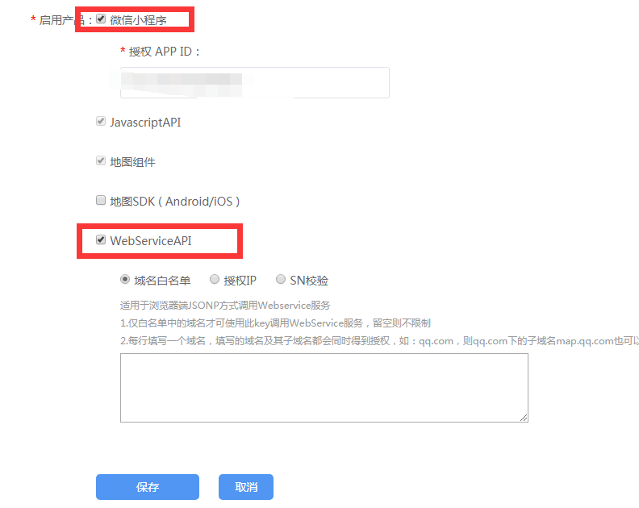

# Taro

## taro 接入微信位置服务sdk的方法

1. [微信位置服务官网](https://lbs.qq.com/guides/startup.html) 在这里下载对应的微信小程序的sdk包
2. [微信位置服务key申请](https://lbs.qq.com/console/mykey.html) 在这里申请对应的key
然后在对应的key管理里面，记得选中这2个
3. 在taro项目src目录下新建utils文件夹，然后把下载的sdk 解压放进去。
4. 不要忘记在微信小程序的后台request合法域名中添加 https://apis.map.qq.com
5. 在组件中直接使用
```
const QQMapWX = require('../../utils/qqmap-wx-jssdk');
export interface HomeState {
  location: any;
  qqMapSdk: any;
}

class Index extends Component<{}, HomeState> {
  constructor(props: {}) {
    super(props);
    // 这里输入自己申请的key
    const qqMapSdk = new QQMapWX({ key: 'XXXXXXXXXXXXXX' });
    this.state = {
      location: '',
      qqMapSdk: qqMapSdk
    };
  }

  config: Config = {
    navigationBarTitleText: '流年的樱花逝',
    navigationBarBackgroundColor: '#187b80'
  };

  componentDidMount() {
    const { qqMapSdk } = this.state;
    let _this = this;
    Taro.getLocation()
      .then(res => {
        qqMapSdk.reverseGeocoder({
          location: { latitude: res.latitude, longitude: res.longitude },
          success: function(res) {
            _this.setState({ location: res.result.address });
          },
          fail: function(res) {
            console.log(res);
          }
        });
      })
      .catch(error => {
        console.log(error);
      });
  }
  ....
```


